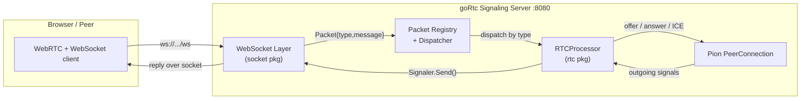
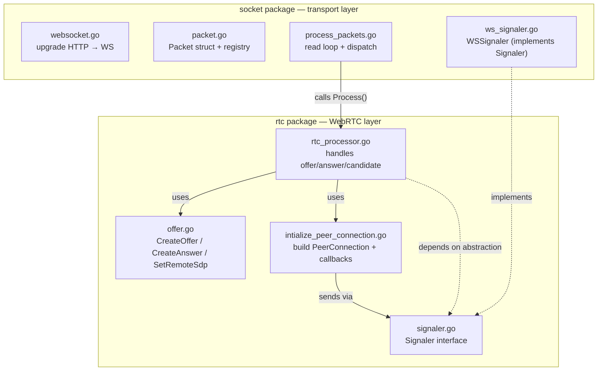
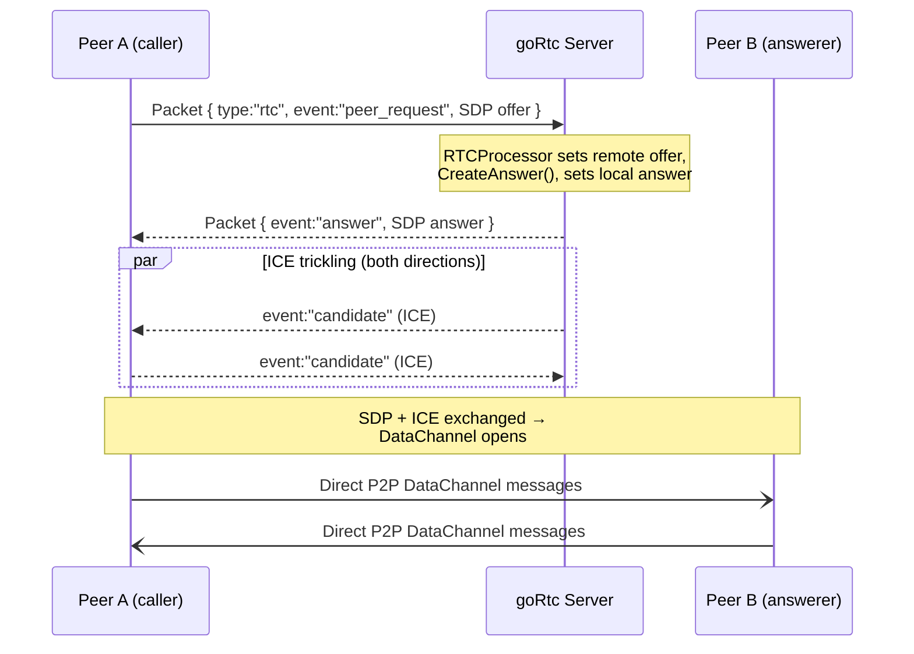
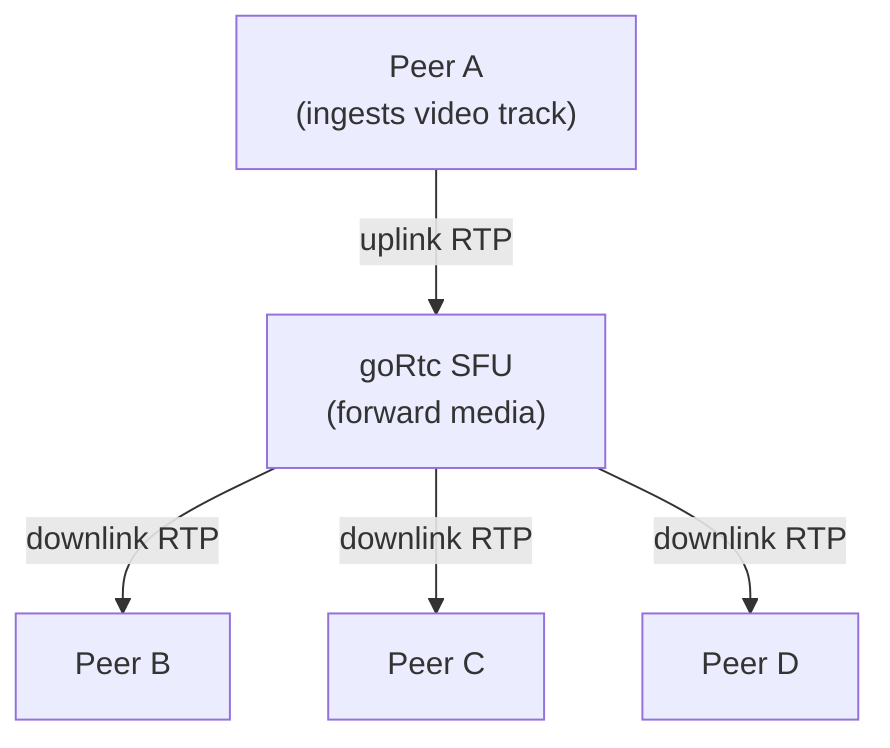

# goRtc

A small **WebRTC signaling server written in Go**, built on top of [Pion WebRTC](https://github.com/pion/webrtc) and [Gorilla WebSocket](https://github.com/gorilla/websocket).

The goal of the project is to learn and demonstrate how peers establish a **peer-to-peer (and eventually peer-to-many-peers)** connection: exchanging SDP offers/answers and ICE candidates through a signaling channel, then talking directly over a WebRTC `DataChannel`.

---

## What is this actually doing?

WebRTC lets two browsers/apps talk **directly** to each other (video, audio, or raw data). But before they can connect, they need to trade some connection info — *"here's my media/data setup"* (SDP) and *"here are the network paths you can reach me on"* (ICE candidates).

They can't send that info directly yet (they don't know how to reach each other), so they need a middleman. **That middleman is this server.** It's called a **signaling server**.

```
        signaling (this server)                 signaling (this server)
   Peer A  ───────────────►  Server  ───────────────►  Peer B
     ▲          offer / answer / ICE candidates          │
     │                                                    │
     └──────────  direct P2P DataChannel  ◄───────────────┘
                  (once connected, server is out of the loop)
```

Once the handshake is done, the two peers talk **directly** — the server steps out of the way.

---

## Architecture

### High-level flow



### Layered design

The code is split into two independent layers so the WebRTC logic never has to know *how* messages travel over the wire.



**Key idea:** the `rtc` package depends only on the `Signaler` *interface*, not on WebSocket. The `socket` package provides `WSSignaler`, a concrete implementation. This means you could swap WebSocket for gRPC or plain TCP without touching any WebRTC code.

---

## The signaling handshake

This is the sequence of messages exchanged to connect two peers. In this example, **Peer A** is the caller (creates the offer) and **Peer B** answers.



### Message events the server understands

| Event          | Meaning                                          | Server action                                        |
| -------------- | ------------------------------------------------ | ---------------------------------------------------- |
| `peer_request` | A peer sent an **SDP offer**                     | Sets remote description, creates & returns an answer |
| `answer`       | A peer replied with an **SDP answer**            | Sets it as the remote description                    |
| `candidate`    | A peer sent an **ICE candidate**                 | Adds it to the active `PeerConnection`               |

---

## Packet format

Every message on the WebSocket is a JSON **`Packet`**. The `type` field decides which processor handles it (currently only `"rtc"` is registered).

```json
{
  "_id": "optional-id",
  "type": "rtc",
  "message": {
    "event": "peer_request",
    "event_data": "<SDP string or ICE candidate JSON>"
  }
}
```

- `type` → routed through the registry to a `PacketProcessor` (`packet.go`).
- `message` → passed to `RTCProcessor.Process()`, which reads `event` to decide what to do.

---

## Project layout

```
gortc/
├── main.go                 # Entry point: HTTP server, /ws handler, wiring
├── peerconfig.json         # Peer host/port config (embedded via go:embed)
├── signaling.go            # Standalone signaling experiment (not on main path)
├── createoffer.go          # Standalone offer helper (not on main path)
│
├── socket/                 # Transport layer (WebSocket)
│   ├── websocket.go        #   HTTP → WebSocket upgrade
│   ├── packet.go           #   Packet struct, processor registry, dispatch
│   ├── processor.go        #   PacketProcessor interface
│   ├── process_packets.go  #   Read loop: parse → validate → dispatch
│   └── ws_signaler.go      #   WSSignaler: sends signals back over the socket
│
└── rtc/                    # WebRTC domain layer (Pion)
    ├── rtc_processor.go             # Handles offer / answer / candidate events
    ├── offer.go                     # CreateOffer, CreateAnswer, SetRemoteSdp
    ├── intialize_peer_connection.go # Builds PeerConnection + ICE/DataChannel callbacks
    └── signaler.go                  # Signaler interface (transport abstraction)
```

---

## How the pieces connect (`main.go`)

For each incoming WebSocket connection, `main.go` wires the two layers together:

```go
conn, _ := socket.UpgradeCurrentRequestToWebrequest(w, r) // 1. HTTP → WebSocket
wsSignaler := &socket.WSSignaler{Conn: conn}              // 2. transport adapter
socket.Register("rtc", &rtc.RTCProcessor{                 // 3. register handler
    Signaler: wsSignaler,
})
socket.ProcessPackets(conn)                               // 4. start read loop
```

1. **Upgrade** the HTTP request to a WebSocket.
2. Wrap the connection in a **`WSSignaler`** (implements the `Signaler` interface).
3. **Register** an `RTCProcessor` for packets of `type: "rtc"`, injecting the signaler.
4. **Loop** forever reading packets and dispatching them to the processor.

---

## Getting started

### Prerequisites

- Go **1.25+**

### Run the server

```bash
go run .
```

You should see:

```
Signaling server started on :8080
```

The signaling endpoint is available at:

```
ws://localhost:8080/ws
```

### Try it

Connect any WebSocket client and send a packet:

```json
{ "type": "rtc", "message": { "event": "peer_request", "event_data": "<your SDP offer>" } }
```

The server will respond with an `answer` event and trickle ICE candidates.

---

## Configuration

- **ICE / STUN server:** `stun:stun.l.google.com:19302` (set in `rtc/intialize_peer_connection.go`).
- **Peer config:** `peerconfig.json` is embedded at build time via `//go:embed`.
- **Listen address:** `:8080` (in `main.go`).

---

## Tech stack

| Piece            | Library                                                                 |
| ---------------- | ----------------------------------------------------------------------- |
| WebRTC engine    | [`github.com/pion/webrtc/v4`](https://github.com/pion/webrtc)           |
| WebSocket        | [`github.com/gorilla/websocket`](https://github.com/gorilla/websocket)  |
| UUIDs            | [`github.com/google/uuid`](https://github.com/google/uuid)              |

---

## Notes & limitations

- The `PeerConnection` is currently stored in a **single package-level variable** (`activeConn`), so the server handles **one peer connection at a time** — fine for learning, not for production multi-peer/room support.
- `signaling.go` and `createoffer.go` are earlier **experiments** and are not part of the main request path (`main.go` → `socket` → `rtc`).
- Origin checking is disabled (`CheckOrigin` returns `true`) for local development — lock this down before deploying.

---

## Roadmap — where this is heading

The end goal is a **multi-peer media forwarder (SFU)**, not just data-channel signaling.

The model:

- **Multiple peers** connect at once (rooms / a connection map instead of the current global `activeConn`).
- A peer **ingests a media track** (video codec carried over a WebRTC media track) into the server.
- The server **fans that single ingested track out to every other peer** — one publisher, many subscribers. There is **no special "host"**; any peer can be a source, and its media is redistributed to everyone in the room.

This is the classic **Selective Forwarding Unit** pattern: the server receives one uplink stream and forwards its RTP packets to all subscribers, so each publisher uploads once instead of once-per-peer.



### Steps to get there

- [ ] Support multiple simultaneous peers (rooms / connection map, drop the global `activeConn`)
- [ ] Add **media tracks** alongside the existing DataChannel path (`OnTrack` on the ingesting peer)
- [ ] **Forward** an ingested track's RTP to all other peers in the room (`TrackLocalStaticRTP` fan-out) — SFU core
- [ ] Handle video codec negotiation on the media track for every subscriber
- [ ] A browser demo client (publish + subscribe)
- [ ] Graceful connection teardown, peer leave/join, and reconnection
